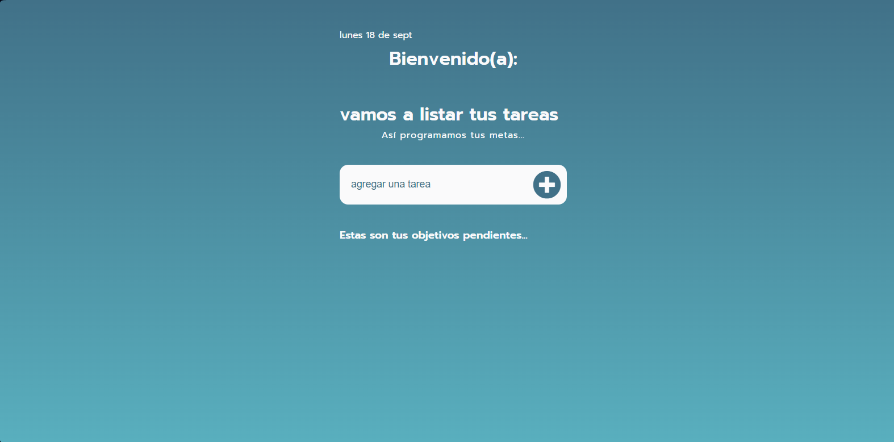

# Aplicación de Lista de Tareas

Esta es una aplicación web de ejemplo básico que te permite crear y administrar tus tareas diarias. Puedes utilizarla para llevar un registro de las tareas que debes completar y marcarlas como completadas una vez que las hayas terminado. La aplicación está construida utilizando tecnologías web como HTML, CSS y JavaScript.

## Instalación

1. Clona este repositorio en tu máquina local.
2. Abre el archivo `index.html` en tu navegador web.

## Uso

1. Escribe el nombre de una tarea en el campo de texto y presiona Enter o haz clic en el botón "Agregar" para añadir la tarea a la lista.
2. Una vez que hayas completado una tarea, marca la casilla de verificación junto a la tarea para marcarla como completada.
3. Si deseas eliminar una tarea de la lista, haz clic en el botón "Eliminar" junto a la tarea correspondiente.

## Contribución

Si deseas contribuir a este proyecto, sigue los pasos a continuación:

1. Realiza un fork de este repositorio.
2. Crea una rama nueva con el nombre de tu función o mejora.
3. Realiza los cambios necesarios y realiza commits con mensajes descriptivos.
4. Envía un pull request indicando los cambios que has realizado.

## Licencia

Este proyecto es esta hecho con fines educativos. Puedes consultar el archivo [LICENSE](LICENSE) para obtener más información.

## Contacto

Si tienes alguna pregunta o sugerencia sobre este proyecto, no dudes en ponerte en contacto conmigo a través de mi dirección de correo electrónico: [bethocubans1990@gmail.com](mailto:bethocubans1990@gmail.com).

¡Espero que esta aplicación de lista de tareas sea útil para ti! ¡Disfrútala y mantén tu día organizado!